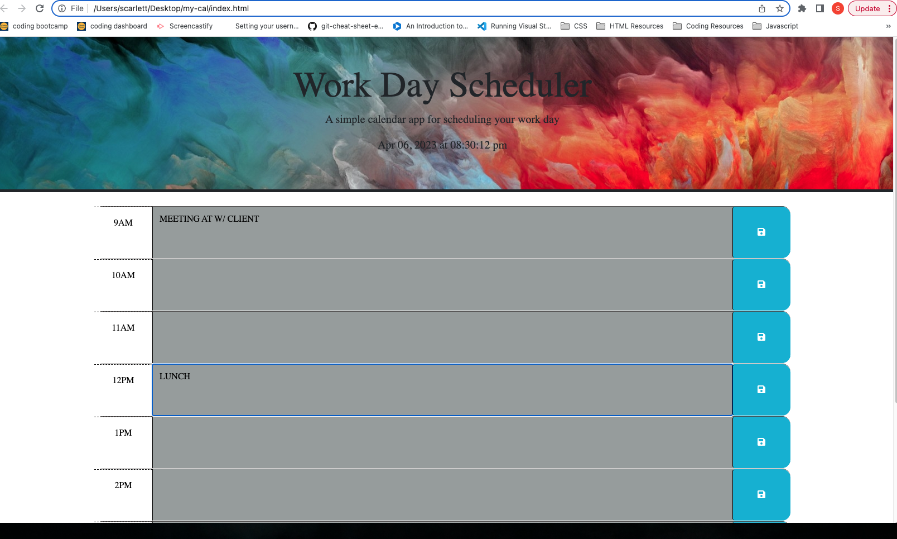

# my-cal

## Technology Used
HTML CSS JavaScript Jquery Git Hub

Description
The motivation behind this project was to make an up to date cal for an employee. This cal includes a running clock and time slots from 9am-5pm that change color as the workday progresses. This cal is meant to help employees keep track of any upcoming meetings and overall makes it a one stop shop for all things such as meetings and to do's while providing the most updated day and time.

## Usage
Creating this cal makes it easier for employees to keep track of all theit meetings and to-do's for the work day while also providing them the current day and time. Each section section provides a saved button to make sure all added notes atay saved.

## Portfolio

Learning points
In this project I had few troubles with the understaning of jquery. Though I understand it makes javascript a little bit easier to use, I found that I often was mixing a lot of variables together. I enjoyed learning how to create a running clock on the page and was excited to see it functioning after writing out a few different codes for it.

## License
N/A

## Credits
"https://code.jquery.com/jquery-3.4.1.min.js"
https://fonts.googleapis.com/css?family=Open+Sans&display=swap